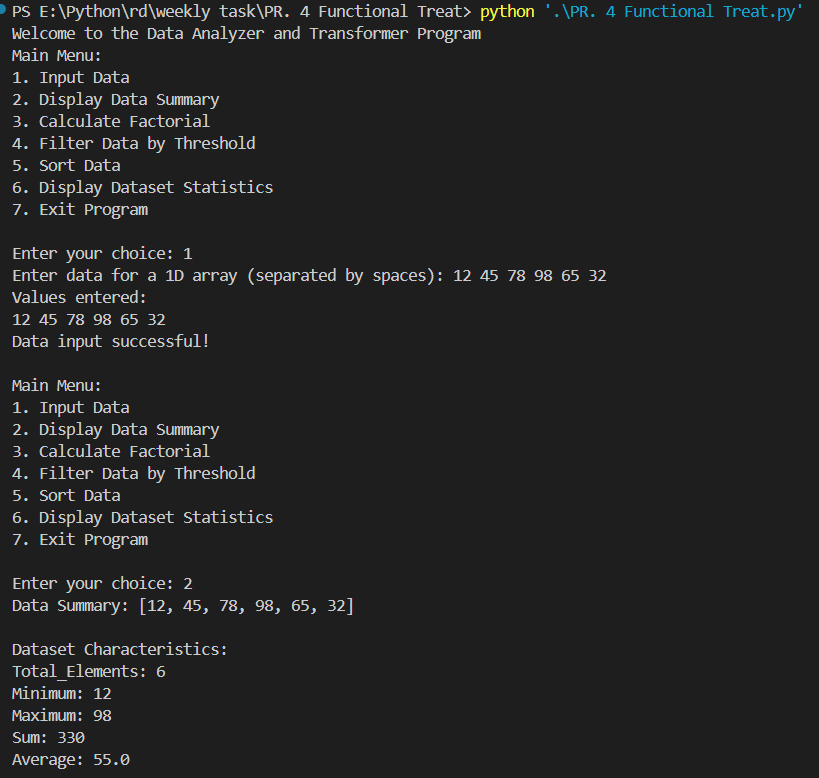
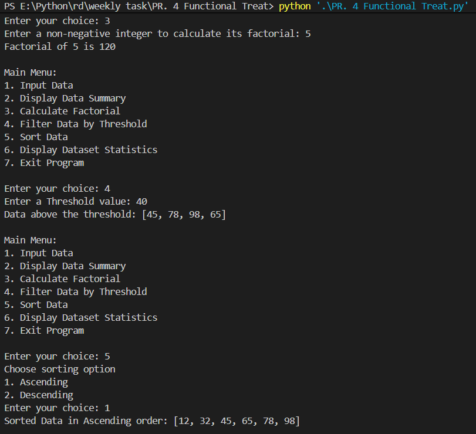
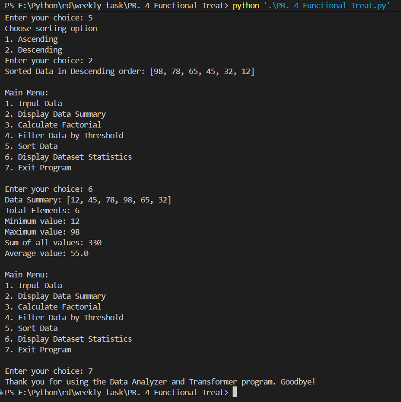

# Data Analyzer and Transformer — Case-by-Case Explanation

## 📌 Project Description

Interactive menu-driven Python program that accepts a 1D numeric dataset and provides quick operations: input, summary, filtering, sorting, and a recursion demo (factorial). The program is educational and implemented as a single script.

## 🔗 Resources

- Repository: https://github.com/patel0506/PR.-4-Functional-Treat
- Explanation video: https://drive.google.com/file/d/1F6yrL1RlXjzWnDspspqbmf5pyj4yyEJs/view?usp=sharing

## 🚀 Features

- Menu-driven interaction
- Data entry and display
- Aggregate statistics (count, min, max, sum, average)
- Filtering with lambda
- Ascending/descending sort
- Factorial via recursion

## 📂 Project Structure

```bash
PR. 4 Functional Treat
├── PR. 4 Functional Treat.py
├── README.md
├── ss1.png
├── ss2.png
├── ss3.png
```

## Data structures & utilities used

- Lists: store the numeric dataset and intermediate results.
- Dictionary: `summary` holds aggregate statistics (count, min, max, average).
- Functions: `update_summary()`, `display_values()`, `dataset_summary()`, `factorial()` provide reusable behavior.
- Lambda + `filter()`: for threshold-based filtering.
- `sorted()`: for ascending/descending order results.
- Pattern matching (`match`/`case`): menu selection handling.

## 🧠 Code Explanation (summary)

The program reads a 1D numeric dataset into a list, keeps an up-to-date `summary` dictionary, and exposes menu-driven operations for input, summary display, filtering, sorting, and a recursion demo (factorial). Helper functions separate I/O from processing to keep the logic modular and testable.

## 🧾 Menu Options

- 1 — Input Data: enter a space-separated list of integers.
- 2 — Display Data Summary: show raw data and aggregate statistics.
- 3 — Calculate Factorial: recursion demo for a non-negative integer.
- 4 — Filter Data by Threshold: show values greater than a threshold.
- 5 — Sort Data: choose ascending or descending order.
- 6 — Display Dataset Statistics: concise aggregated stats.
- 7 — Exit: quit the program.

## ▶️ How the Program Works

On start the program enters a loop that displays the menu and accepts the user's choice. For each option it validates inputs, calls the appropriate helper function, updates `summary` when data changes, prints results, and returns to the menu until the user chooses to exit.

## ▶️ How to Run

Run from the folder containing the script:

```powershell
python "PR. 4 Functional Treat.py"
```

---

## Global scope and `global` keyword

Example from the project:

```python
dataset = []
summary = {}

def update_summary():
    global summary
    if not dataset:
        summary = {}
        return
    summary = {
        "Total Elements": len(dataset),
        "Minimum": min(dataset),
        "Maximum": max(dataset),
        "Average": sum(dataset) / len(dataset)
    }
```

Explanation: `global summary` tells Python that assignments to `summary` inside `update_summary()` should modify the module-level variable rather than create a new local name. Use `global` only when you need to reassign a module variable; returning values and assigning them at module level is often clearer and easier to test.

## `*args` (positional argument expansion)

Code example:

```python
def display_values(*args):
    print("Values entered:")
    for value in args:
        print(value, end=" ")
    print()

# call site
display_values(*dataset)
```

Explanation: `*args` collects extra positional arguments into a tuple named `args`. Calling `display_values(*dataset)` expands the list so each element becomes a separate positional argument inside the function.

## `**kwargs` (keyword argument expansion)

Code example:

```python
def dataset_summary(**kwargs):
    print("Dataset Characteristics:")
    for key, value in kwargs.items():
        print(f"{key}: {value}")

# call site
dataset_summary(
    Total_Elements=len(dataset),
    Minimum=min(dataset),
    Maximum=max(dataset),
    Sum=sum(dataset),
    Average=sum(dataset)/len(dataset)
)
```

Explanation: `**kwargs` collects extra keyword arguments into a dictionary named `kwargs`. Each named argument passed at the call site becomes an entry in that dictionary; the function can then iterate, format, or forward these named values.

Notes: prefer explicit parameters or returned results for simpler, more testable functions; use `global`, `*args`, and `**kwargs` when they add clarity or flexibility.

---

## Case 1 — Input Data

Code:

```python
data_input = input("Enter data for a 1D array (separated by spaces): ")
tokens = [t for t in data_input.split() if t.strip()]
if not tokens:
    print("No data entered. Please try again.\n")
dataset = [int(x) for x in tokens]
update_summary()
display_values(*dataset)
print("Data input successful!\n")
```

Detailed explanation:

1. Tokenization and trimming: the code uses `data_input.split()` to split on whitespace and then filters out any empty tokens with `[t for t in data_input.split() if t.strip()]`. This handles accidental extra spaces.

2. Empty input handling: if the token list is empty the program prints a message and returns control to the menu. This prevents downstream errors from attempting to convert or summarize no data.

3. Conversion and validation: tokens are converted with `int(x)` which will raise `ValueError` on non-integer input. The current snippet assumes valid integers; in production you should wrap the conversion in a `try/except` and prompt the user again on invalid tokens. Optionally accept floats via `float()` and normalize to `int` or keep as floats.

4. Assignment semantics: `dataset = [int(x) for x in tokens]` replaces the previous dataset with the newly-entered values. If you want to append instead, use `dataset.extend(...)`.

5. Summary update and display: after assignment `update_summary()` recalculates aggregate statistics and `display_values(*dataset)` prints each value. The `*dataset` expands the list into positional arguments for `display_values()`.

6. Complexity: tokenization and conversion are O(n) where n is the number of tokens.

7. Example:

Input: `10 5 7 12`
Result: `dataset = [10, 5, 7, 12]` and the printed summary will reflect these values.

---

## Case 2 — Display Data Summary

Code:

```python
if dataset:
    print(f"Data Summary: {dataset}\n")
    dataset_summary(
        Total_Elements=len(dataset),
        Minimum=min(dataset),
        Maximum=max(dataset),
        Sum=sum(dataset),
        Average=sum(dataset)/len(dataset)
    )
else:
    print("No data available. Please input data first.\n")
```

Detailed explanation:

1. Existence guard: the `if dataset:` test checks truthiness of the list; an empty list is falsy and skips the summary logic, avoiding `ValueError` from `min()`/`max()` or division by zero when computing the average.

2. What is displayed: the code prints the raw `dataset` and calls `dataset_summary(...)` with named stats: `Total_Elements`, `Minimum`, `Maximum`, `Sum`, and `Average`. `dataset_summary` receives these as keyword arguments and formats them for display.

3. Synchronization: this approach assumes `summary` is up-to-date. If other code paths can modify `dataset` without calling `update_summary()`, consider calling `update_summary()` here to ensure consistency.

4. Formatting tips: for readability round the average to a fixed number of decimal places (e.g., `round(avg, 2)`) and include thousands separators for large sums.

5. Complexity: computing `min`, `max`, and `sum` each take O(n). If performance matters, compute all aggregates in a single pass to keep complexity O(n).

6. Example output:

Dataset: `[10, 5, 7, 12]`
Total_Elements: 4
Minimum: 5
Maximum: 12
Sum: 34
Average: 8.5

---

## Case 3 — Calculate Factorial

Code:

```python
def factorial(n):
    if n == 0 or n == 1:
        return 1
    else:
        return n * factorial(n - 1)
num = int(input("Enter a non-negative integer to calculate its factorial: "))
if num < 0:
    print("Factorial is not defined for negative numbers.\n")
    # repeat or continue
result = factorial(num)
print(f"Factorial of {num} is {result}\n")
```

Detailed explanation:

1. Algorithm and base case: `factorial(n)` uses recursion with base case `n == 0 or n == 1` returning 1. For n > 1 it returns `n * factorial(n - 1)`.

2. Input validation: the code converts the input to `int` and guards against negative numbers. It should also handle non-integer input with a `try/except` and reject decimals (or round them explicitly) because factorial is defined for non-negative integers.

3. Recursion depth: Python's recursion limit (default ~1000) limits the largest `n` you can compute this way. For larger `n` prefer an iterative implementation:

```python
def factorial_iter(n):
    result = 1
    for i in range(2, n+1):
        result *= i
    return result
```

4. Complexity: factorial runs in O(n) time and produces very large integers; Python supports big integers but computations become slower and memory grows with the number size.

5. Example: Input `5` prints `Factorial of 5 is 120`.

---

## Case 4 — Filter Data by Threshold

Code:

```python
if dataset:
    threshold = int(input("Enter a Threshold value: "))
    filtered_data = list(filter(lambda x: x > threshold, dataset))
    print(f"Data above the threshold: {filtered_data}\n")
else:
    print("No data available. Please input data first.\n")
```

Detailed explanation:

1. Guard and input parsing: the code first ensures `dataset` is not empty. It then reads `threshold = int(input(...))`. As with other inputs, wrap parsing with `try/except` to handle invalid entries.

2. Filtering behavior: `filtered_data = list(filter(lambda x: x > threshold, dataset))` returns a new list containing only elements strictly greater than `threshold`. If inclusive behavior is desired use `x >= threshold`.

3. Original data preservation: the original `dataset` is not modified; `filtered_data` is a separate list. If you want to modify the original list, reassign or use list comprehensions to mutate in place.

4. Complexity: single-pass O(n) where n is the dataset size.

5. Extensions: allow the user to choose comparison operator, or accept arbitrary predicates (e.g., even/odd, within range) and show count of matches.

6. Example: `dataset = [1,5,10,15]`, `threshold=9` → `filtered_data = [10,15]`.

---

## Case 5 — Sort Data

Code:

```python
print("Choose sorting option")
print("1. Ascending")
print("2. Descending")
option = int(input("Enter your choice: "))
match option:
    case 1:
        if dataset:
            ascending_data = sorted(dataset)
            print(f"Sorted Data in Ascending order: {ascending_data}\n")
        else:
            print("No data available. Please input data first.\n")
    case 2:
        if dataset:
            descending_data = sorted(dataset, reverse=True)
            print(f"Sorted Data in Descending order: {descending_data}\n")
        else:
            print("No data available. Please input data first.\n")
    case _:
        print("Invalid Input")
```

Detailed explanation:

1. User choice and parsing: the code prompts the user to choose ascending (1) or descending (2). It uses `option = int(input(...))` and `match option:` to dispatch. Validate invalid choices and non-integer input.

2. Sorting semantics: `sorted(dataset)` returns a new list sorted in ascending order while `sorted(dataset, reverse=True)` returns it in descending order. `sorted()` is stable and uses Timsort with average and worst-case O(n log n) time and O(n) auxiliary space.

3. Original dataset: because `sorted()` returns a new list, the original `dataset` remains unchanged. To update the dataset in-place use `dataset.sort()`.

4. Complexity and performance: sorting is O(n log n). For very large datasets consider external sorting or more memory-efficient approaches.

5. Example: `dataset = [3,1,2]` → ascending `[1,2,3]`, descending `[3,2,1]`.

---

## Case 6 — Display Dataset Statistics

Code:

```python
if dataset:
    print(f"Data Summary: {dataset}\nTotal Elements: {len(dataset)}\nMinimum value: {min(dataset)}\nMaximum value: {max(dataset)}\nSum of all values: {sum(dataset)}\nAverage value: {sum(dataset) / len(dataset)}\n")
else:
    print("No data available. Please input data first.\n")
```

Detailed explanation:

1. What is computed: prints the raw dataset and then the following aggregates: total elements (`len(dataset)`), minimum (`min(dataset)`), maximum (`max(dataset)`), sum (`sum(dataset)`), and average (`sum(dataset)/len(dataset)`).

2. Guarding: the `if dataset:` guard prevents calling these functions on an empty list which would otherwise raise exceptions or divide by zero.

3. Single-pass optimization: computing `min`, `max`, and `sum` separately iterates the list multiple times. For efficiency compute them in a single pass:

4. Example output: same as in Case 2 — clear, human-friendly summary.

---

## Learning Outcomes

After completing this project, the following concepts were successfully implemented:

✅ Built-in Functions

✅ User Defined Functions

✅ *args

✅ **kwargs

✅ Global Variables

✅ Recursion

✅ Lambda Functions

✅ Sorting Collections

✅ Pattern Matching

✅ Data Analysis using Python Lists

---

## Example outputs with screenshots

These screenshot examples were captured from the program run.

### ss1 



### ss2 



### ss3 



